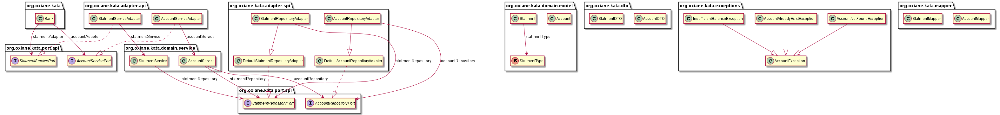

# Bank kata # 

Bank account kata focus on these opeations (deposit, withdraw and statment printing)

**Requirements**
* Deposit and Withdrawal
* Account statement (date, amount, balance)
* Statement printing

## User Stories ##

- US 1:  
  In order to save money  
  As a bank client  
  I want to make a deposit in my account  

- US 2:  
  In order to retrieve some or all of my savings  
  As a bank client  
  I want to make a withdrawal from my account  

* US 3:  
	In order to check my operations  
	As a bank client  
	I want to see the history (operation, date, amount, balance) of my operations  

### Solution

This application is designed according to the exadecimal architecture model 
- SPI and API adapters are located in their respective packages
- Idem for ports
- The Bank program use the api to interact with the domain.

All business rules are implemented in domain classes `AccoutService` and `StatmentService`.  
For convenience collections are used as  default repository adapter are implemented to persit objects *Account* & *Statment*.

Uml diagram of classes is shown below

